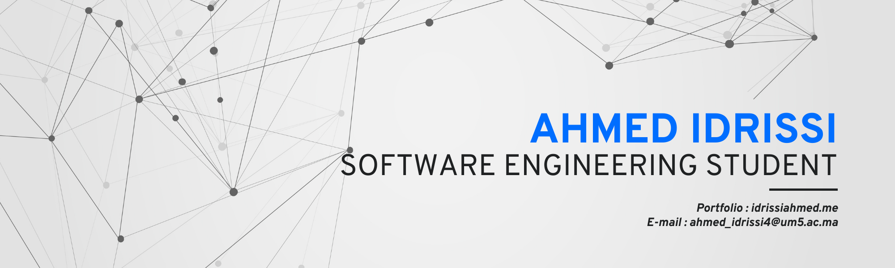

<h1 align="center">
  <b>Ahmed IDRISSI</b>
</h1>

<picture>

</picture>
 

Hi there 👋 I'm Ahmed IDRISSI, a Software Engineering student at National School of Computer Science and Systems Analysis (ENSIAS) Rabat, Morocco.
<ul>
  <li>I’m currently learning web development, machine learning and deep learning.</li>
  <li>I'm also a competitive programmer.</li>
  <li>How to reach me: ahmed_idrissi4@um5.ac.ma</li>
  <li>My portfolio: <a href="https://idrissiahmed.me">https://idrissiahmed.me</a></li>
</ul>

  
  

 

 
 

|                                                                     Ahmed's Stats                                                                     |
|:------------------------------------------------------------------------------------------------------------------------------------------------------:|
|  |
|                     |
|               | 

[Credits : ahmedidrissi](https://github.com/ahmedidrissi)
